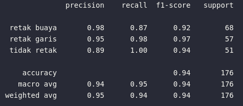
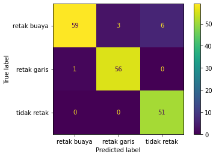
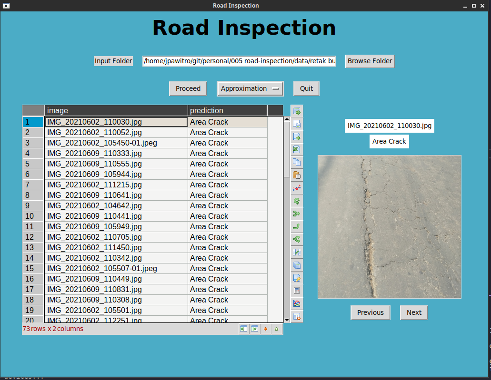
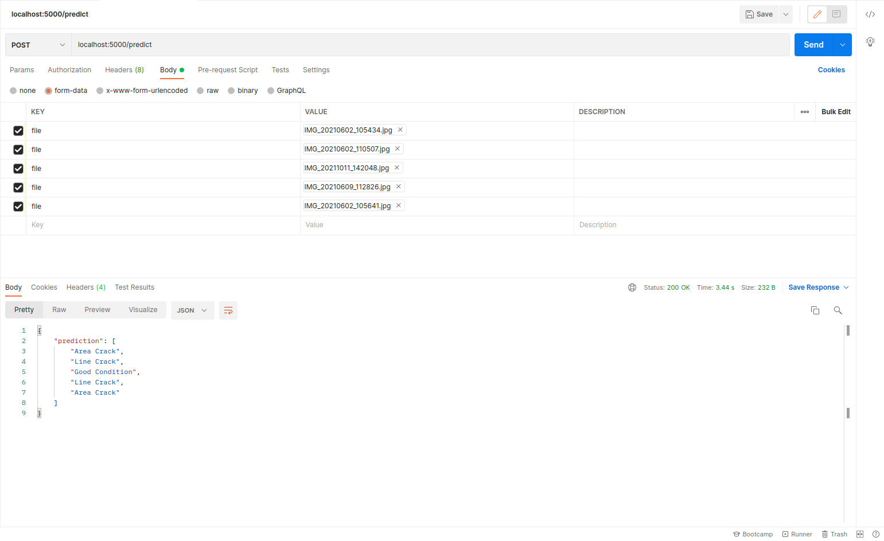

# 005-road-inspection
Image Classification for Public Road Inspection using Keras Neural Network and Wavelets for Feature Extraction.

## Introduction
The purpose of the project was to provide an automatic labeling of road through both API for future development of mobile reporting app and the GUI to be used by field engineer for fast labeling during after the inspection.

## Methods
The features extracted using 2 dimensional wavelet and trained using convolutional neural networks.

## Results

### Classification Report

### Confusion Matrix

### GUI

### API Test
