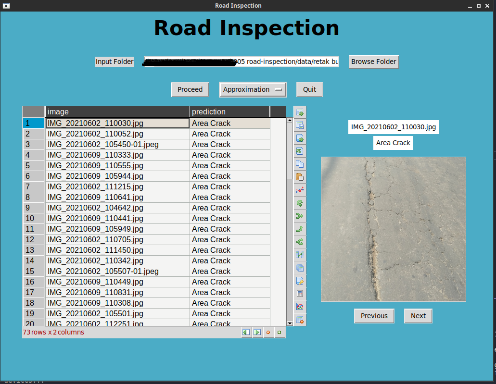

# Image Classification for public road defect using CNN and Wavelet for Feature Extraction.

## Introduction
The purpose of the project was to provide automatic labeling of road defects through both API & desktop GUI. API was meant for future development of the mobile reporting app and the GUI is to be used directly by the field engineer for quick labeling during the inspection.

## Datasets
The datasets consists of images of road defects in Indonesia, categorized into three, which are tidak retak (in a good condition), retak garis (line crack) and retak buaya (area crack).

PS: Buaya means crocodile, the field engineers/technicians use this term because of the resemblance of the road defect and crocodile leather.

## Methods
The features of images were extracted using a 2-dimensional wavelet and a convolutional neural networks algorithm was used for training the model.

## Results
The model performance achieved 94% accuracy.

### Classification Report

### Confusion Matrix

### GUI

### API Test
